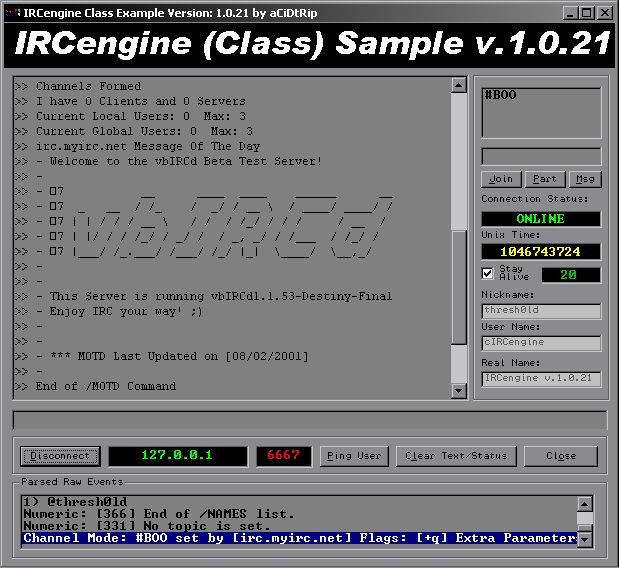



## IRCengine v\.1\.0\.21 \(UPDATE\)

### Description

IRCengine v1.0.21, An IRC parser for IRC Clients compiled in a Class Module...Just an update for the old version of IRCengine v1.0.17, fixed some bugs and added some new features...Now Supports DCC...check it out...
 
### More Info
 

             |
---                |---
**Submitted On**   |2003-03-09 22:43:32
**By**             |[aCiDtRip](https://github.com/Planet-Source-Code/PSCIndex/blob/master/ByAuthor/acidtrip.md)
**Level**          |Intermediate
**User Rating**    |4.8 (19 globes from 4 users)
**Compatibility**  |VB 5\.0, VB 6\.0
**Category**       |[Object Oriented Programming \(OOP\)](https://github.com/Planet-Source-Code/PSCIndex/blob/master/ByCategory/object-oriented-programming-oop__1-47.md)
**World**          |[Visual Basic](https://github.com/Planet-Source-Code/PSCIndex/blob/master/ByWorld/visual-basic.md)
**Archive File**   |[IRCengine\_155715392003\.zip](https://github.com/Planet-Source-Code/acidtrip-ircengine-v-1-0-21-update__1-43605/archive/master.zip)

